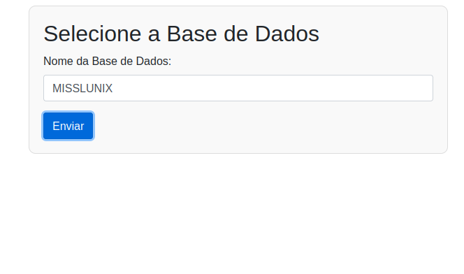
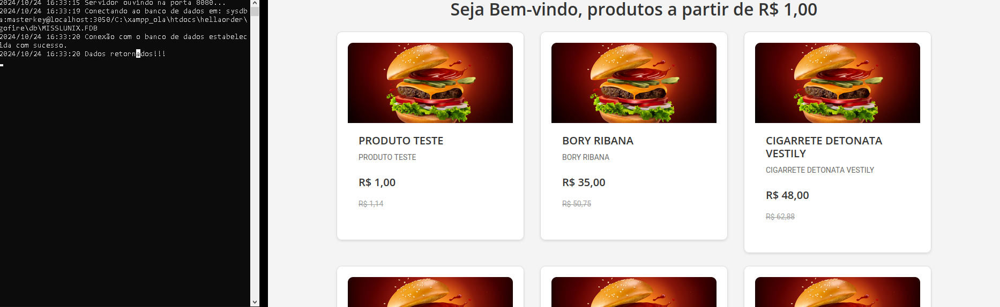

Hella Order

## Como funciona
1 - O usuário informa qual base quer acessar

2 - A API é chamada pelo PHP em $api_url = "http://localhost:8080/produtos?db=" . urlencode($base_de_dados);

3 - A API acessa a pasta /db (https://github.com/DaveSongnata/hellaorder/tree/main/gofire/db) onde deverá estar a base de dados .FDB (Foi utilizado a versão 3.0)

4 - A API retorna um JSON com as informações da base.

5 - O PHP monta a página web para exibir os cards e com base no preço define qual o menor preço (e exibe no cabeçalho o menor preço)

## Como usar
Você irá precisar de:
    
    - PHP instalado + Servidor (XAMPP: https://www.apachefriends.org/pt_br/index.html)
    
    - GOlang instalado (para modificações no código-fonte, pois também tem o arquivo .exe para execução em Windows)
    
    - Conexão com a internet ou baixar algumas dependências como por exemplo presentes em visualizar.php ou index.php:
    
        -https://stackpath.bootstrapcdn.com/bootstrap/4.5.2/css/bootstrap.min.css
        
        -https://fonts.googleapis.com/css2?family=Roboto:wght@400;700&family=Open+Sans:wght@300;400;600&display=swap
        
        -https://code.jquery.com/jquery-3.5.1.slim.min.js
        
        -https://cdn.jsdelivr.net/npm/@popperjs/core@2.5.4/dist/umd/popper.min.js
        
        -https://stackpath.bootstrapcdn.com/bootstrap/4.5.2/js/bootstrap.min.js

## Screenshots

## Screenshots

  

      
    
  

